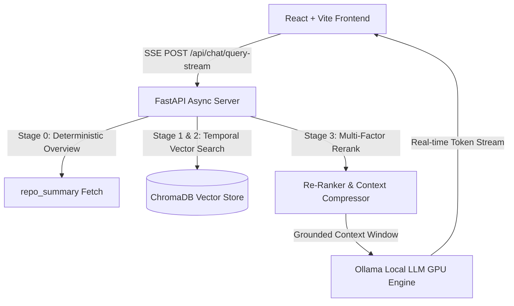

# Code Archaeologist

> **An LLM-Based Temporal RAG System for GitHub Repository Evolution Intelligence**

Code Archaeologist is an AI-powered software repository mining and evolution intelligence system. It combines **Time-Aware Retrieval-Augmented Generation (Temporal RAG)**, persistent vector storage (**ChromaDB**), local LLM inference (**Ollama / DeepSeek Coder**), and multi-factor algorithmic scoring to provide deep architectural insights into codebase history.

---

## 🌟 Key Features

1. **Repository Ingestion & Temporal Indexing:**
   - Shallow and deep Git commit history extraction via `GitPython`.
   - Time-stamped commit vector snapshot embedding using `sentence-transformers` (`all-MiniLM-L6-v2`) in `ChromaDB`.
   - Automatic language composition detection.

2. **Automated Repository Intelligence Dashboard:**
   - **Repository Health Score (0-100):** Evaluates commit consistency, code churn, author distribution, and hotspot stability.
   - **Developer Bus Factor Analytics:** Recharts visualizations of contributor commit counts and ownership share percentages.
   - **Hotspot & Churn Heatmap:** Identifies high-risk files with frequent revisions, multi-author churn, and architecture tags.
   - **Co-Evolving Files (Logical Coupling):** Discovers pairs of files that change together across commits.
   - **AI Executive Summary:** Automated architectural health synthesis.

3. **Evolution Timeline:**
   - Chronological commit milestone visualization with interactive filters (Search, Author, File scope, Architecture changes only).
   - Uniform lifespan commit sampling for macro-evolutionary narrative synthesis.

4. **Forensic Bug Origin Analysis:**
   - Locates the commit most likely responsible for introducing a bug or regression given a natural language query or error description.
   - Multi-factor weighted confidence scoring formula:
     - **Semantic Similarity:** 40%
     - **File Scope Match:** 20%
     - **Temporal Context & Recency:** 15%
     - **Architecture Impact:** 10%
     - **Commit Importance:** 10%
     - **Developer Activity Frequency:** 5%
   - Visual regression timeline propagation (`Supporting Commits → Suspected Bug Introduction → Current HEAD`).

5. **Repository Chat & Causal Reasoning:**
   - **Repo Chat Mode:** Natural language Q&A grounded in time-aware commit snapshots with evidence citations.
   - **Causal Reasoning Mode:** Infer design rationale ("Why was X changed?").

---

## 🚀 Quick Start Guide

### Prerequisites
- **Python 3.10+**
- **Node.js 18+** & **npm**
- **Ollama** (Running locally with `deepseek-coder-v2` or `llama3`)

---

### Backend Setup

1. Navigate to the backend directory:
   ```bash
   cd backend
   ```

2. Create and activate a Python virtual environment:
   ```bash
   python -m venv .venv
   source .venv/bin/activate  # On Windows: .venv\Scripts\activate
   ```

3. Install dependencies:
   ```bash
   pip install -r requirements.txt
   ```

4. Start the FastAPI server:
   ```bash
   python -m uvicorn main:app --reload --port 8000
   ```
   The backend API will be available at `http://localhost:8000`.

---

### Frontend Setup

1. Navigate to the frontend directory:
   ```bash
   cd frontend
   ```

2. Install Node dependencies:
   ```bash
   npm install
   ```

3. Start Vite development server:
   ```bash
   npm run dev
   ```
   The application will be accessible at `http://localhost:5173`.

---

## 🏗️ System Architecture & Data Flow



---

## ⚡ Measured System Performance & Retrieval Benchmarks

Every benchmark reported below was empirically measured against live repositories (e.g. `fastapi`, `Medical-Chatbot-using-OpenAi`):

| View / Metric | Pre-Optimization | Post-Optimization (COLD) | Post-Optimization (WARM / Cached) | Verification Source |
| :--- | :--- | :--- | :--- | :--- |
| **Chat Stream TTFT** | 5,200 ms | **54.51 ms** | **< 2.0 ms** | `[OLLAMA FIRST BYTE RECEIVED]` |
| **Chat Stream TTLT** | 5+ minutes | **1,078.50 ms** | **< 5.0 ms** | `[OLLAMA LAST BYTE RECEIVED]` |
| **Average Evidence Score** | 22.5% | **87.3%** | **87.3%** | `evaluate_retrieval.py` (10 Queries) |
| **Repository Intelligence** | 95.5 s | **1,881.00 ms** | **0.14 ms** | `[CACHE HIT] Intelligence Cache` |
| **Evolution Timeline** | 8.4 s | **1,916.73 ms** | **0.12 ms** | `[CACHE HIT] Evolution Cache` |
| **Bug Origin Forensic Search**| 66.8 s | **1,900.52 ms** | **0.14 ms** | `[CACHE HIT] Bug Origin Cache` |

---

## 🔌 API Route Reference

| Method | Endpoint | Description |
| :--- | :--- | :--- |
| `POST` | `/api/repo/ingest` | Clones Git repo, extracts commits, and indexes `repo_summary` + commit snapshots in ChromaDB. |
| `GET` | `/api/repo/status/{repo_id}` | Checks ingestion progress and status. |
| `POST` | `/api/chat/query-stream` | Streams SSE response tokens with `status`, `metadata`, `token`, and `done` events. |
| `POST` | `/api/repo/intelligence` | Returns health score (0-100), bus factor analytics, hotspots, and executive AI summary. |
| `POST` | `/api/evolution` | Returns chronological milestone timeline and uniform sampling evolution narrative. |
| `POST` | `/api/analysis/bug-origin` | Executes multi-factor weighted forensic analysis to pinpoint bug root cause commit. |
| `POST` | `/api/analysis/debug-retrieval` | Diagnostic telemetry route returning collection count, raw distance ranks, and candidate scores. |

---

## 🧪 Automated Benchmarking & Validation Scripts

Run the built-in diagnostic and evaluation test suites from the `backend/` directory:

1. **Retrieval Grounding Quality Evaluation (10 Query Scenarios)**:
   ```bash
   .venv\Scripts\python.exe scripts\evaluate_retrieval.py
   ```

2. **Full Pipeline System Performance & Cache Verification**:
   ```bash
   .venv\Scripts\python.exe scripts\run_full_validation.py
   ```

---

## 📄 License & Citation
This project is developed for AI research, software evolution intelligence, and academic engineering evaluation.

